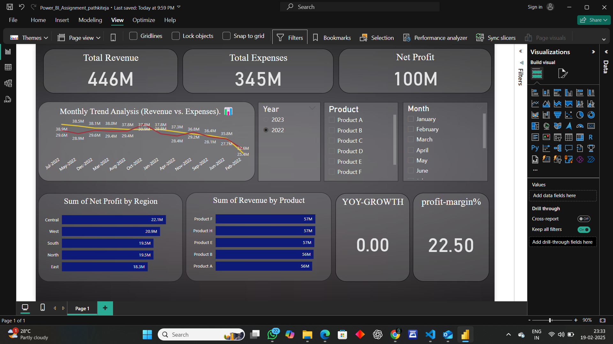

# Power BI Assignment II - Task Completion

## Description

This repository contains my completed Power BI Assignment II as requested. The task involved creating a comprehensive Power BI dashboard with various visualizations and applying DAX formulas for data analysis. The key components of this task were:

- **Data Preparation & Cleaning**: Importing data into Power BI and cleaning it.
- **Data Visualization**: Creating multiple visualizations including a line chart, bar charts, and slicers for Year, Month, and Product Category.
- **DAX Measures**: Calculating YoY Growth and Profit Margin % using DAX formulas.
- **Filters & Slicers**: Adding interactive slicers to filter by Year, Month, and Product Category.

## Files Included

- **PowerBI_Assignment_II.pbix**: The completed Power BI report file.
- **PowerBI_Expanded_Dataset.xlsx**: The dataset used for the analysis.
- **Power BI Multiple Questions.docx**: A document with multiple questions and their answers related to the assignment.

## Steps Performed

1. **Data Preparation & Cleaning**:
   - Loaded the dataset into Power BI.
   - Removed duplicates and handled missing values.
   - Created a calculated column for Net Profit (Revenue - Expenses).

2. **Data Visualization**:
   - Created a **Monthly Trend Analysis** visualization showing Revenue vs Expenses.
   - Created a **Sum of Net Profit by Region** bar chart.
   - Created a **Sum of Revenue by Product** bar chart.
   - Applied **Top N filters** for the products based on the sum of revenue.

3. **DAX Measures**:
   - Created a DAX measure to calculate **Year-on-Year Growth (YoY Growth)**.
   - Created a DAX measure to calculate **Profit Margin %** (Profit/Revenue).

4. **Filters & Slicers**:
   - Added slicers for **Year**, **Month**, and **Product** to allow the user to interact with the dashboard and filter the data dynamically.

## Demo Screenshot

## How to Use

1. Download and open the `PowerBI_Assignment_II.pbix` file in Power BI Desktop.
2. You can view the dashboard and interact with the slicers to filter data by Year, Month, and Product.
3. The visualizations will update dynamically based on the slicer selections.
